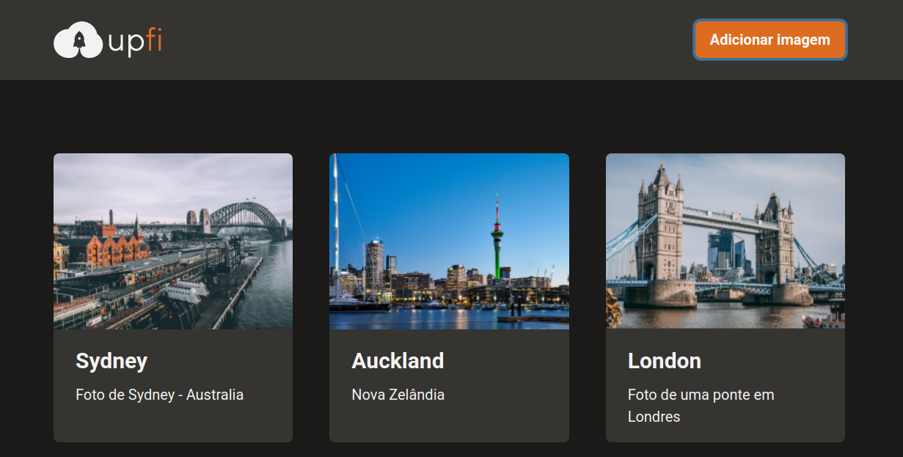
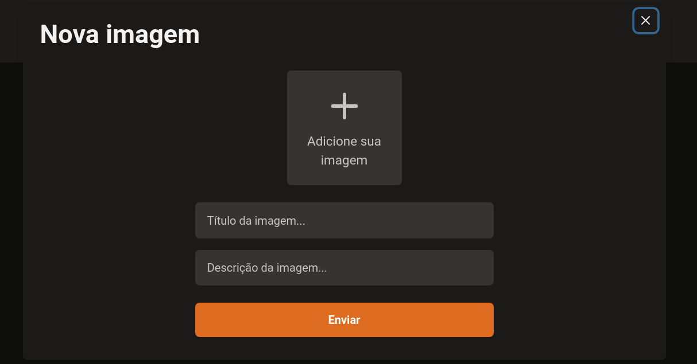

<h1 align="center">   </h1>

<h1 align="center"> 📸 Upload images  </h1>

<p align="center">
   
  
  
  
  
  
</p>

<br>

# 👩‍💻 About

<p align="justify">In this challenge, the main goal is to build an image upload application with ReactJS, TypeScript, Chakra UI, ImgBB and FaunaDB.

</p>

<br>

# 🎨 Layout

<div align="center">
  <p align="center">
  
  <br>
    
  </p>
</div>

<br>

# 📽️ Demo

<div align="center">
  <p align="center">
    
  </p>
</div>

<br>

# :rocket: Tecnologies

- [ReactJS](https://reactjs.org/)
- [NextJS](https://nextjs.org/)
- [TypeScript](https://www.typescriptlang.org/)
- [React Query](https://react-query.tanstack.com/)
- [React Hook Form](https://react-hook-form.com/)
- [ImgBB](https://imgbb.com/)
- [FaunaDB](https://fauna.com/)
- [Figma](https://figma.com/)
- [Chackra UI](https://chakra-ui.com/)


<br>

# 🔧 Run Locally

Clone the project

```bash
  git clone git@github.com:git@github.com:Joseane-Guedes/Ignite-challenge08.git
```

Go to the project directory

```bash
  cd Ignite-challenge08
```

Install dependencies

```bash
  yarn
```

Start the server

```bash
  yarn dev
```

# :closed_book: License

Released in 2021 :closed_book: License

This project is under the [MIT license](./LICENSE).

#

<!-- <p align="center">
   <b> &#60;/&#62; by <a href="https://www.linkedin.com/in/joseane-guedes/">Joseane Guedes</a></b>
</p> -->

Made with :purple_heart: by [Rocketseat](https://rocketseat.com.br/ignite) :rocket: and [Joseane Guedes ](https://github.com/Joseane-Guedes) :woman_technologist:
